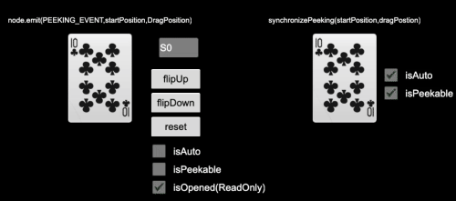
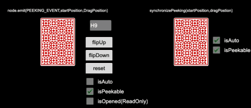

# Cocos Creator 舖克元件

## 概述

該元件適用於 CocosCreator 2.2.3 ＋

元件內容含有 52 張鋪克牌（可自定義）、翻牌動畫、蓋牌動畫、瞇牌互動

---

## 範例展示





---

## 匯入組件

- 尚未匯出，稍等後續版本

---

## 元件使用說明

- 屬性

|       名稱 |     屬性      | 預設值 | 描述                                                                                                     |
| ---------: | :-----------: | :----: | :------------------------------------------------------------------------------------------------------- |
|      value |    string     |        | C:梅花 D:方塊 Ｈ:紅心 S:黑桃 </br> [0-9,JQK]:數值(0 代表 10) </br> 範例：“C0”代表梅花十 、“HJ”代表紅心Ｊ |
|     isAuto |    boolean    | false  | 是否依照有數值就自動開牌的                                                                               |
| isPeekable |    boolean    | false  | 是否啟動瞇牌互動                                                                                         |
|   isOpened | boolean(唯讀) |        | 牌面是否已開啟                                                                                           |

- 方法

> - 翻牌:flipUp
>
> ```js
> leftPoker.flipUp();
> ```
>
> - 蓋牌:flipDown
>
> ```js
> leftPoker.flipDown();
> ```
>
> - 重設:reset
>
> ```js
> leftPoker.reset();
> ```
>
> - 同步瞇牌:synchronizePeeking
>
> ```js
> let startDraggingPosition = cc.v2(0, 0);
> let draggingPosition = cc.v2(10, 0);
> leftPoker.synchronizePeeking(startDraggingPosition, draggingPosition);
> ```

- 事件

> - 瞇牌事件:PokerCardPeeking
>
> ```js
> import {PEEKING_EVENT} from './PokerCard'
> leftPoker.node.on(PEEKING_EVENT, onPeeking);
> function onPeeking(startPosition, dargPostion) {
>   //startPosition:cc.v2
>   //dargPostion:cc.v2
>   //做些事情
> }
> ```
>
> - 重設事件:PokerCardReseting
>
> ```js
> import {RESETING_EVENT} from './PokerCard'
> leftPoker.node.on(RESETING_EVENT, onReset);
> function onReset( ) {
>   //做些事情
> }
> ```